University: [ITMO University](https://itmo.ru/ru/)  
Faculty: [FICT](https://fict.itmo.ru)  
Course: [Network programming](https://github.com/itmo-ict-faculty/network-programming)  
Year: 2024/2025  
Group: K34212  
Author: Nikita Kuznetsov
Lab: Lab2  
Date of create: 20.11.2024  
Date of finished: 21.11.2024  

## Лабораторная работа №2 "Развертывание дополнительного CHR, первый сценарий Ansible"

### <a name="section0">Оглавление</a>
- [Оглавление](#section0)
- [Описание](#section1)
- [Цель работы](#section2)
- [Ход работы](#section3)
  - [Подготовка второго CHR устройства](#section3.1)
  - [Работа с Ansible](#section3.2)
  - [Запуск playbook.yaml](#section3.4)
  - [Результаты выполнения](#section3.3)
- [Вывод](#section4)

## <a name="section1">Описание</a>
В ходе данной лабораторной работы будет рассмотрено использование системы управления конфигурациями Ansible для автоматизации процесса настройки и развертывания сетевых устройств.

## <a name="section2">Цель работы</a>
Используя Ansible, выполнить настройку нескольких сетевых устройств и собрать информацию о их конфигурации. Также необходимо грамотно составить файл инвентаризации (Inventory).

## <a name="section3">Ход работы</a> 

### <a name="section3.1">Подготовка второго CHR устройства</a>  
В соответствии с инструкциями из первой лабораторной работы, необходимо развернуть вторую виртуальную машину с MikroTik CHR, подключиться к ней через Winbox и настроить интерфейс WireGuard для обеспечения связи между устройствами.

<p align="center">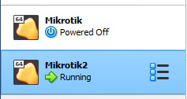</p>

Затем создаём новый интерфейс дляV2, который будет использоваться для связи с сервером, и обновляем конфигурацию на сервере для поддержания соединения.

<p align="center">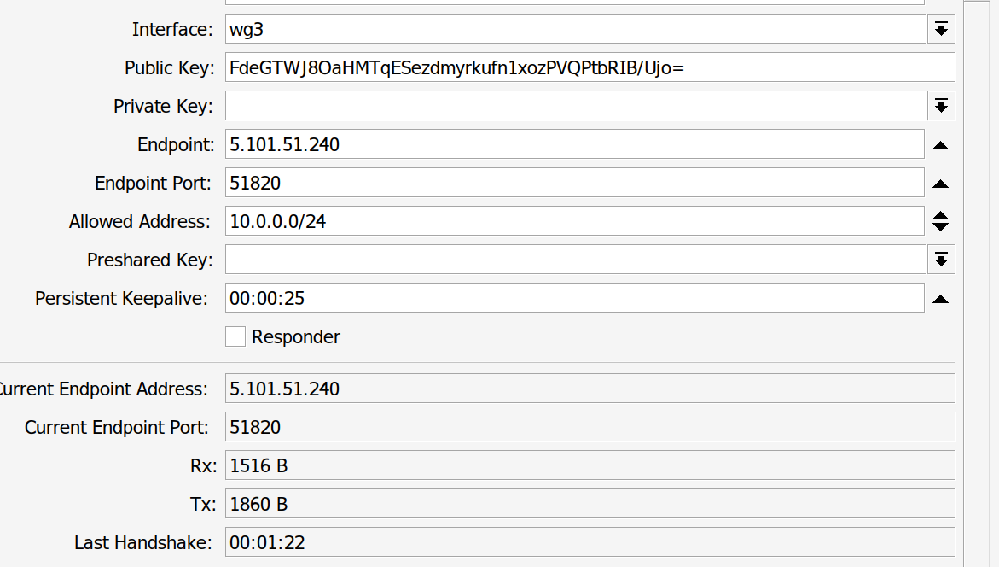</p>

<p align="center">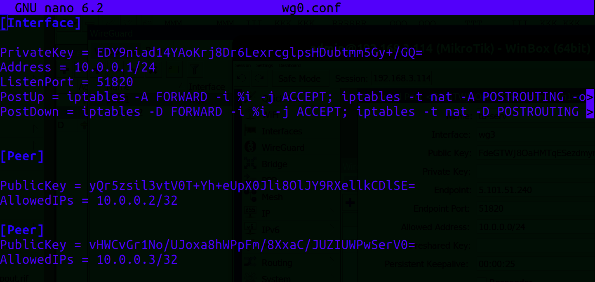</p>

Далее настраиваем интерфейс для подключения двух виртуальных машин CHR через WireGuard. Проверяем доступность соединения междуV1 и сервером:

* V1 (IP: 192.168.3.95)

<p align="center">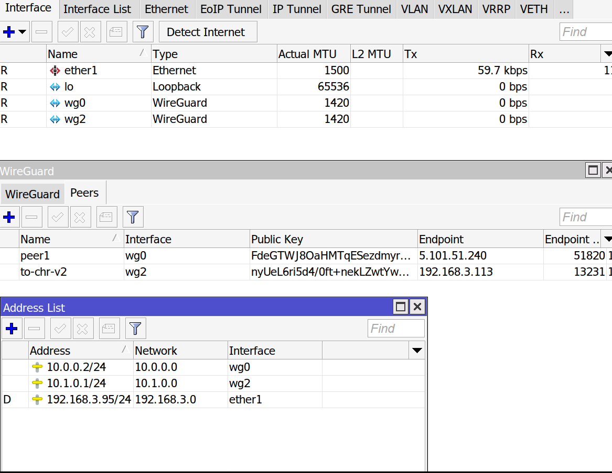</p>

* V2 (IP: 192.168.3.113)

<p align="center">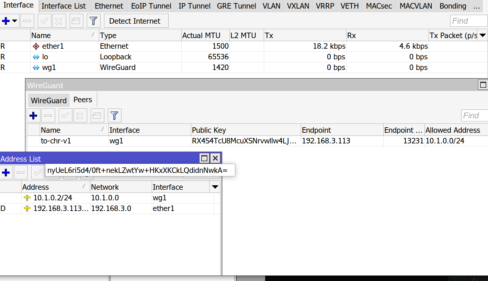</p>

Проверяем связь:

* V1 ->V2

<p align="center">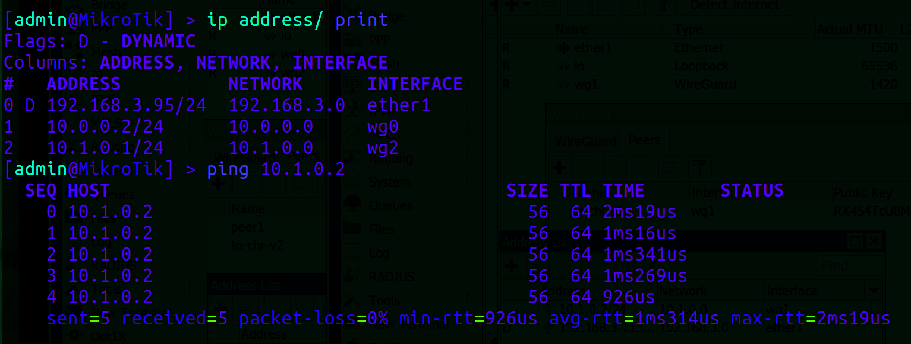</p>

* V2 ->V1

<p align="center">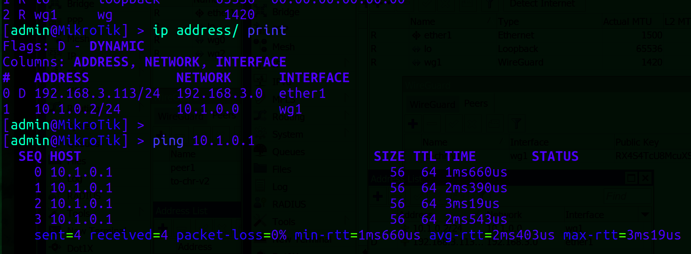</p>

Все устройства находятся в одной локальной сети, однако для настройки маршрутизации между различными подсетями можно использовать команды для разрешения трафика:

```bash
iptables -A FORWARD -s 10.0.0.0/24 -d 10.2.0.0/24 -j ACCEPT
iptables -A FORWARD -s 10.2.0.0/24 -d 10.0.0.0/24 -j ACCEPT
```

### <a name="section3.2">Работа с Ansible</a>  

Ansible использует SSH для подключения к удалённым хостам, а WireGuard в данном контексте выполняет роль защищённого канала для SSH-соединений.

Для начала настраиваем SSH-ключи для устранения необходимости вводить пароль каждый раз при подключении.

<p align="center">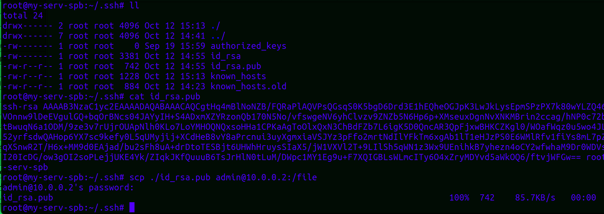</p>


Импортируем публичный ключ на сервер и убеждаемся, что теперь аутентификация выполняется без запроса пароля.

<p align="center">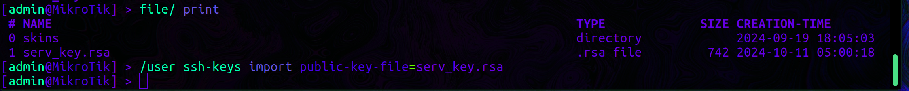</p>

<p align="center">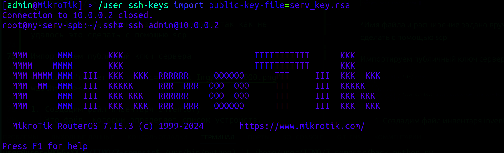</p>

То же самое проделываем дляV2.

1. Создаём файл **hosts** в каталоге **inventory**, который будет содержать информацию о подключаемых устройствах.

<p align="center">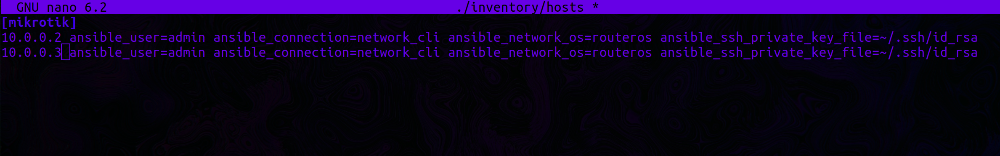</p>

В этом файле настраиваются такие параметры:
- `ansible_connection=network_cli` — для указания, что устройства являются сетевыми.
- `ansible_network_os=routeros` — для указания операционной системы устройств.
- `ansible_ssh_private_key_file=~/.ssh/id_rsa` — для указания пути к приватному ключу SSH.

2. Также создаём конфигурационный файл **ansible.cfg** для задания глобальных настроек для всех устройств.

<p align="center">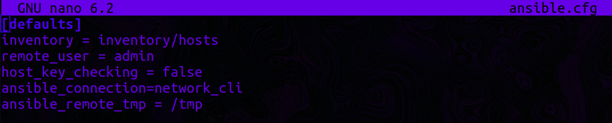</p>

Эти параметры будут применяться ко всем хостам, если не переопределены в файле **hosts**. Теперь проверяем связь с устройствами, используя команду:

```bash
ansible -i ./inventory/hosts mikrotik -m ping
```

<p align="center">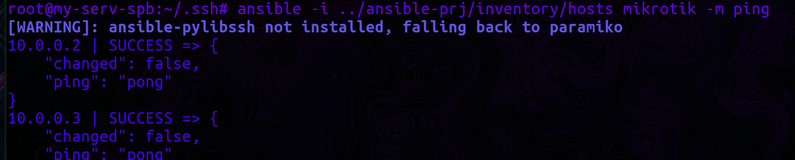</p>

3. Создаём playbook — основной файл, в котором определены задачи, которые необходимо выполнить на устройствах.

Каждый **play** в файле указывает, какие устройства нужно настроить и какие задачи выполнить. Для нашей задачи используется коллекция `community.routeros`, подходящая для работы с MikroTik.

Модифицируем файл **hosts** для его окончательной версии.

<p align="center">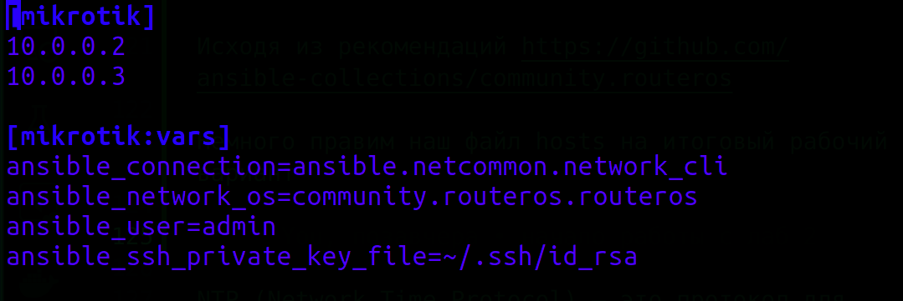</p>

Также необходимо установить библиотеку **ansible-pylibssh** (или **Paramiko**), которая позволяет использовать SSH в Ansible:

```bash
pip install ansible-pylibssh
```

<details>
<summary><b>Тестовый сценарий для модуля community.routeros</b></summary>

```yaml
---
- name: RouterOS test with network_cli connection
  hosts: mikrotik
  gather_facts: false
  tasks:
    - name: Run a command
      community.routeros.command:
        commands:
          - /system resource print
      register: system_resource_print
    - name: Print its output
      ansible.builtin.debug:
        var: system_resource_print.stdout_lines

    - name: Retrieve facts
      community.routeros.facts:
    - ansible.builtin.debug:
        msg: "First IP address: {{ ansible_net_all_ipv4_addresses[0] }}"

```
</details>
Результат выполнения:

- Информация о системных ресурсах обоих RouterOS была успешно получена.
- Были собраны факты, такие как версия RouterOS, IP-адреса и другие параметры устройства.

<p align="center">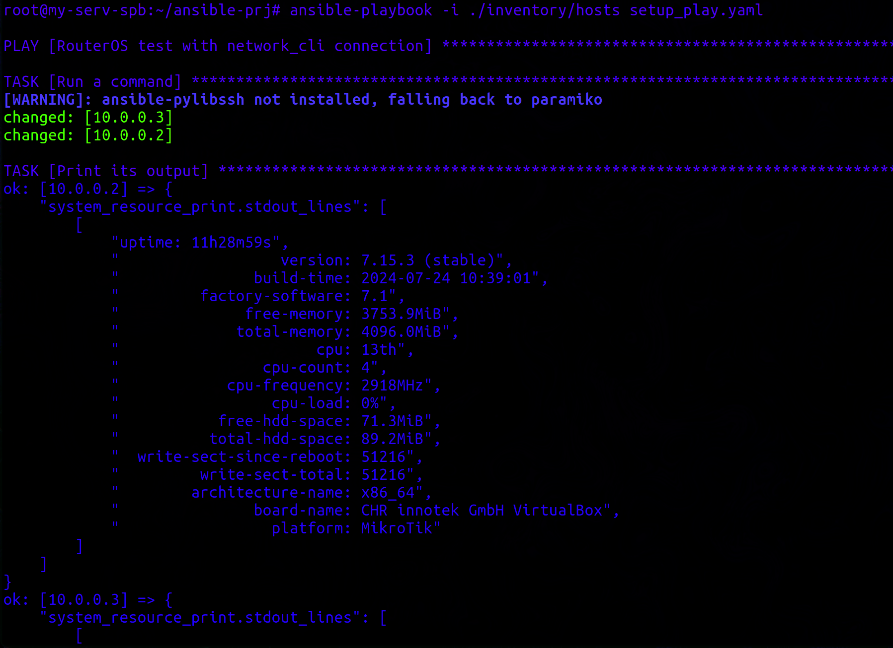</p>

Теперь обновим шаблон playbook для выполнения задач, таких как смена пароля и настройка NTP-клиента.

NTP (Network Time Protocol) используется для синхронизации времени на устройствах сети с использованием внешних NTP-серверов.

```yaml
---
- name: Setup MikroTik CHR
  hosts: mikrotik
  gather_facts: no
  tasks:
    - name: Set admin login credentials
      community.routeros.command:
        commands:
          - /user set admin password="QWERTY"
      register: user_verify
      ignore_errors: no

    - name: Verify Сhanges
      ansible.builtin.debug:
        msg: "Настройки изменены"

    - name: Show user change result
      ansible.builtin.debug:
        msg: |
          "Пароль на устройстве {{ inventory_hostname }} был изменён на {{ user_verify }}"

    - name: Configure NTP Client
      community.routeros.command:
        commands:
          - /system ntp client set enabled=yes mode=unicast
          - /system ntp client servers add address=216.239.35.4
          - /system ntp client servers add address=216.239.35.8  # Google NTP servers
          - /system ntp client print
      register: ntp_result
      ignore_errors: no
```

<p align="center">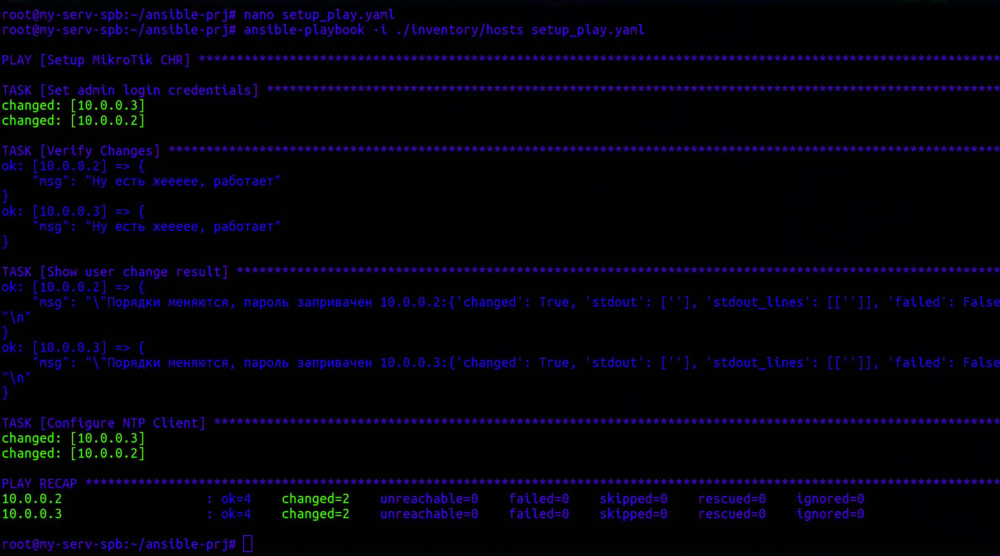</p>

<p align="center">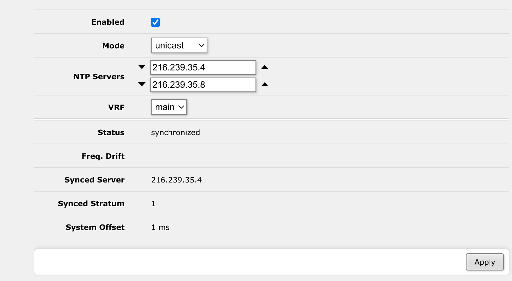</p>

Теперь добавим настройки O

SPF с указанием уникального Router ID для каждого устройства и соберем данные о топологии OSPF и полной конфигурации устройств.

OSPF — это протокол маршрутизации, используемый для обмена маршрутацией внутри одной автономной системы (AS). В MikroTik RouterOS настраиваем интерфейсы OSPF для работы с конкретными зонами OSPF.

**Важно!** Для корректной работы OSPF необходимо обновить конфигурацию интерфейсов WireGuard, добавив в Allowed Addresses мультикаст-адрес 224.0.0.5/32 и адрес Router ID loopback-интерфейса.

<p align="center">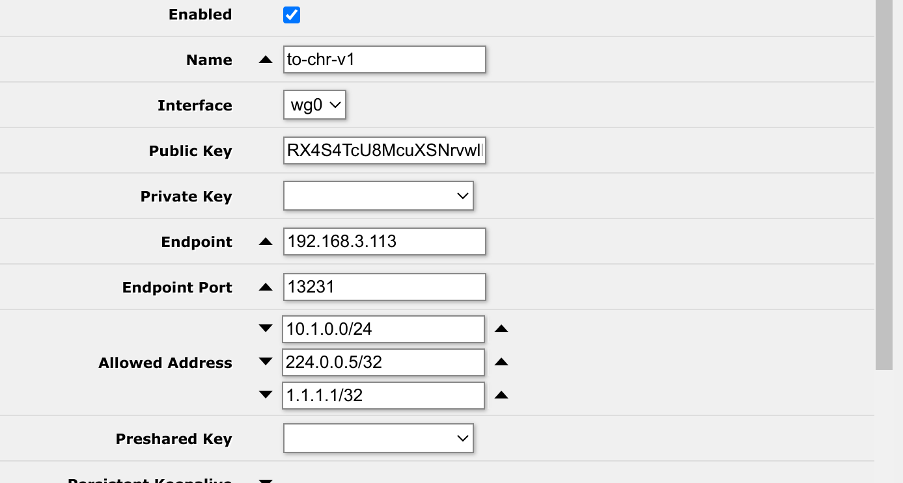</p>

```yaml
- name: Configure OSPF with specific Router ID for each CHR
  community.routeros.command:
    commands:
      - /ip address add address={{ router_id }} interface=lo
      - /routing ospf instance add disabled=no name=skynet router-id={{ router_id }} redistribute=connected,static
      - /routing ospf area add disabled=no instance=skynet name=backbone
      - /routing ospf interface-template add area=backbone cost=100 disabled=no type=ptp interfaces={{ router_int }}
  vars:
    router_id: "{{ '1.1.1.1' if ansible_host == '10.0.0.2' else '3.3.3.3' }}"
    router_int: "{{ 'wg2' if ansible_host == '10.0.0.2' else 'wg0' }}"

- name: OSPF topology data
  community.routeros.command:
    commands:
      - /routing/ospf/neighbor/print
      - /routing/ospf/interface/print
      - /routing/ospf/area/print
      - /routing/ospf/instance/print
  register: ospf_data

- name: Get full device configuration
  community.routeros.command:
    commands:
      - /export
  register: full_config

- name: Print OSPF data
  ansible.builtin.debug:
    var: ospf_data

- name: Print full device configuration
  ansible.builtin.debug:
    var: full_config
```

### <a name="section3.4">Выполнение</a>

<p align="center">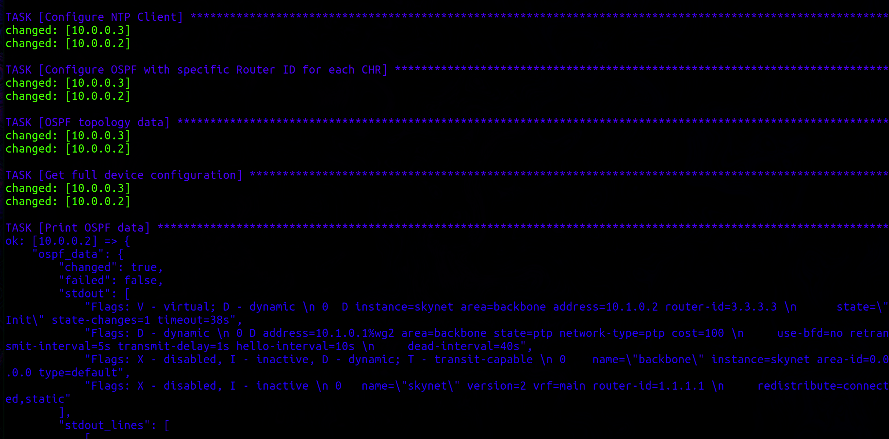</p>

<p align="center">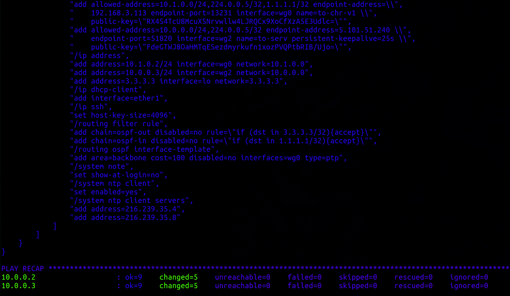</p>

### <a name="section3.3">Результаты выполнения</a>  

После выполнения настроек OSPF, конфигурации и изменений на устройствах, можно наблюдать успешное подключение и корректную работу OSPF между CHR:

* V1  
<p align="center">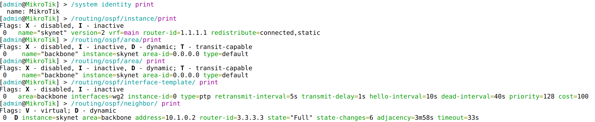</p>

* V2  
<p align="center">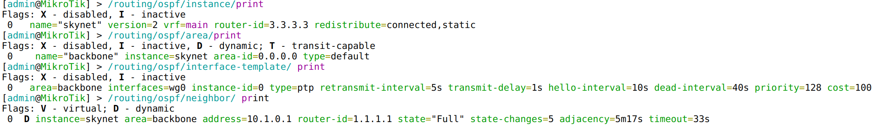</p>

<p align="center">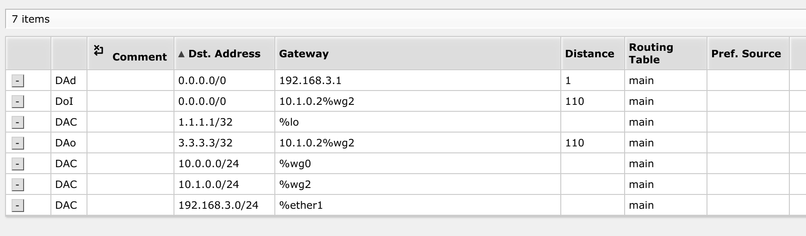</p>

<p align="center">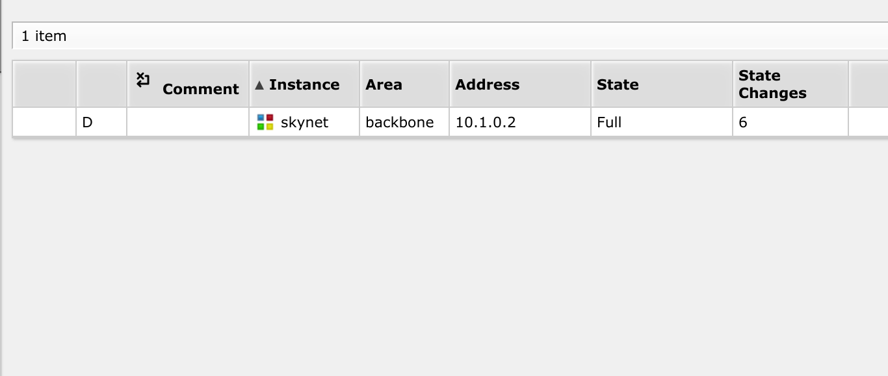</p>

<p align="center">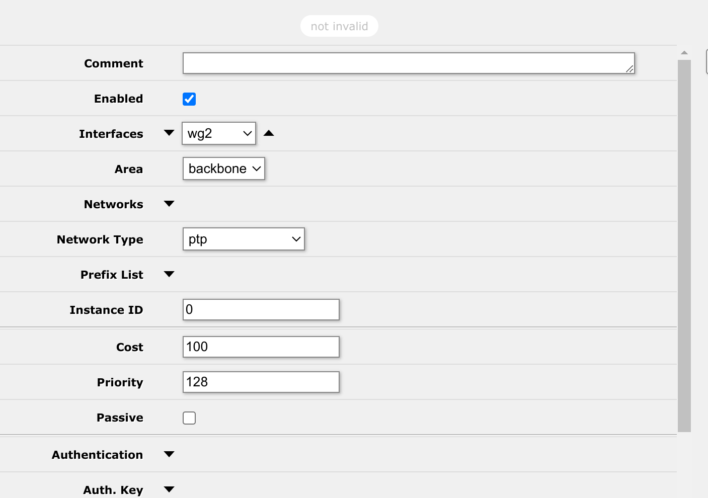</p>

## <a name="section4">Вывод</a>  

В ходе работы было настроено взаимодействие между MikroTik через WireGuard, включены сервисы NTP и OSPF, а также была выполнена автоматизация с помощью Ansible для настройки устройств и сбора информации.