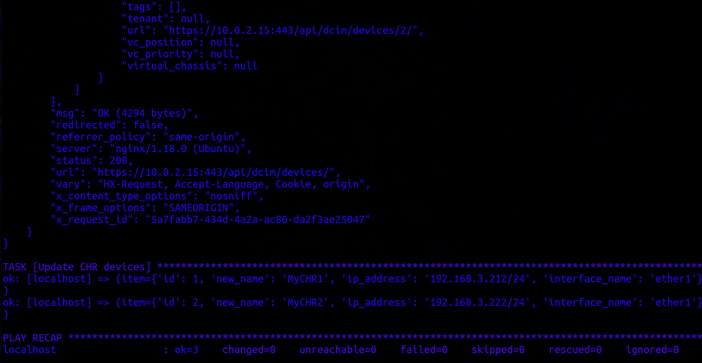

University: [ITMO University](https://itmo.ru/ru/)  
Faculty: [FICT](https://fict.itmo.ru)  
Course: [Network programming](https://github.com/itmo-ict-faculty/network-programming)  
Year: 2024/2025  
Group: K34212  
Author: Nikita Kuznetsov
Lab: Lab3  
Date of create: 22.11.2024  
Date of finished: 24.11.2024  

## Лабораторная работа №3 "Развертывание NetBox, сеть связи как источник правды в системе технического учета NetBox"

## <a name="section1">Описание</a>
В рамках этой лабораторной работы будет рассмотрена интеграция инструментов Ansible и NetBox для сбора и управления информацией о сетевых устройствах.

## <a name="section2">Цель работы</a>
Цель работы — используя инструменты Ansible и NetBox, извлечь полную информацию об устройствах сети и сохранить её в формате файла.

## <a name="section3">Ход работы</a>

### <a name="section3.1">Установка NetBox</a>

Для установки NetBox необходимо следовать официальной документации, представленной по [ссылке](https://netboxlabs.com/docs/netbox/en/stable/installation/).

Дополнительную информацию о настройке интеграции Ansible с NetBox можно найти в [этом руководстве](https://netboxlabs.com/blog/getting-started-with-network-automation-netbox-ansible/).

NetBox представляет собой открытое веб-приложение, предназначенное для управления и документации компьютерных сетей, включая такие функции, как:

* Управление IP-адресами (IPAM): работа с IP-адресами, VRF, VLAN.
* Управление инфраструктурой дата-центра (DCIM): организация серверных стоек, оборудования.
* Устройства: создание и управление устройствами с указанием их типов и мест установки.
* Соединения: управление сетевыми, консольными и силовыми соединениями.
* Виртуализация: работа с виртуальными машинами и кластерами.
* Схемы передачи данных: отображение схем связи и провайдеров.
* Защищённое хранение секретных данных.

Для развертывания NetBox на новой виртуальной машине можно использовать официальный репозиторий с GitHub.

<p align="center"></p>

Сначала устанавливаем PostgreSQL, создаём базу данных и пользователя, после чего даём нужные привилегии.

<p align="center"></p>

Redis используется для кэширования данных и выполнения фоновых задач, и в большинстве случаев его достаточно настроить по умолчанию, как указано в примере конфигурации в файле `configuration_example.py`.

<p align="center"></p>

Теперь устанавливаем необходимые зависимости:

```bash
sudo apt install -y python3 python3-pip python3-venv python3-dev build-essential libxml2-dev libxslt1-dev libffi-dev libpq-dev libssl-dev zlib1g-dev
```

Далее клонируем репозиторий NetBox с GitHub.

<p align="center"></p>

<p align="center"></p>

После настройки файла `configuration.py` и генерации секретного ключа с помощью команды:

```bash
python3 ./generate_secret_key.py
```

Запускаем скрипт обновления `upgrade.sh`, который выполняет несколько ключевых действий:

* Создаёт виртуальное окружение для Python.
* Устанавливает все необходимые зависимости.
* Выполняет миграцию базы данных.
* Генерирует документацию.
* Объединяет статические ресурсы.

<p align="center"></p>

<p align="center"></p>

Создаём суперпользователя для доступа к интерфейсу.

<p align="center"></p>

Теперь необходимо пробросить порты с виртуальной машины на хост и открыть интерфейс NetBox для дальнейшей работы.

<p align="center"></p>

Настроим Gunicorn и Nginx для корректной работы приложения, иначе невозможно будет добавлять новые устройства в систему.

NetBox работает как приложение WSGI за HTTP-сервером.

<p align="center"></p>

<p align="center"></p>

<p align="center"></p>

<p align="center"></p>

<p align="center"></p>

Не забудьте прокинуть дополнительные порты для полноценной работы.

<p align="center"></p>

Так как сертификат был выдан самостоятельно, подключение может быть незащищённым.

<p align="center"></p>

### <a name="section3.2">Работа с NetBox</a>

Создаём новые типы устройств, указываем их роли, платформы, а также добавляем сами устройства с соответствующей информацией.

<p align="center"></p>

<p align="center"></p>

Также создаём новый токен для аутентификации.

<p align="center"></p>

### <a name="section3.3">Интеграция Ansible с NetBox</a>

Для выполнения действий с Ansible используется дополнительная виртуальная машина с установленным NetBox.

Добавляем информацию о NetBox в инвентарь Ansible, создав файл `netbox_inventory.yml`:

```yaml
---
plugin: netbox.netbox.nb_inventory
api_endpoint: https://10.0.2.15:443/
token: tut token kotory sdelali
validate_certs: False
config_context: False
```

Проверяем работоспособность инвентаря с помощью команды:

```bash
ansible-inventory -v --list -i netbox_inventory.yml
```

Вывод команды подтверждает, что Ansible успешно подключился к NetBox и получил информацию о двух устройствах — CHR и CHR-V2.

<p align="center"></p>

Для сохранения полученной информации в файл формата JSON можно использовать команду:

```bash
ansible-inventory --list -i netbox_inventory.yml > inventory_output.json
```

<p align="center"></p>

Запускаем тестовый playbook, который на основе данных из NetBox проводит операции с устройствами.

<p align="center"></p>

<p align="center"></p>

Пример playbook’а, который собирает информацию о устройствах и интерфейсах с NetBox:

```yaml
---
- name: Gather device information including interfaces and IPs from NetBox
  hosts: localhost
  connection: local
  gather_facts: false
  vars:
    netbox_url: "https://10.0.2.15:443"
    netbox_token: "tut token"

  tasks:
    - name: Get all devices from NetBox
      uri:
        url: "{{ netbox_url }}/api/dcim/devices/"
        headers:
          Authorization: "Token {{ netbox_token }}"
        validate_certs: false
        return_content: true
      register: devices_response

    - name: Get interfaces for each device and combine with devices
      uri:
        url: "{{ netbox_url }}/api/dcim/?device={{ item.id }}/interfaces"
        headers:
          Authorization: "Token {{ netbox_token }}"
        validate_certs: false
        return_content: true
     

 register: interfaces_response
      loop: "{{ devices_response.json.results }}"
      loop_control:
        loop_var: item

    - name: Build a list of devices with their interfaces
      set_fact:
        devices_with_interfaces: "{{ devices_with_interfaces | default([]) + [{'device': item, 'interfaces': interfaces_response.json.results | default([])}] }}"
      loop: "{{ devices_response.json.results }}"
      loop_control:
        loop_var: item

    - name: Save devices and interfaces to JSON file
      copy:
        dest: netbox_devices.json
        content: "{{ devices_with_interfaces | to_json | indent(2) }}"
```

Запускаем playbook:

```bash
ansible-playbook -i netbox_inventory.yml netbox_main.yml
```

<p align="center"></p>

### <a name="section3.4">Обновление данных устройств</a>

Для обновления данных устройств, таких как имя или IP-адрес, можно использовать следующий playbook:

```yaml
    - name: Update device names
      uri:
        url: "{{ netbox_url }}/api/dcim/devices/{{ item.id }}/"
        method: PATCH
        headers:
          Authorization: "Token {{ netbox_token }}"
          Content-Type: "application/json"
        body: >
          {
            "name": "{{ item.new_name }}"
          }
        body_format: json
        validate_certs: false
      loop:
        - { id: 1, new_name: "MyCHR1" }
        - { id: 2, new_name: "MyCHR2" }
```

<p align="center"></p>

<p align="center"></p>

Для обновления серийных номеров устройств в NetBox можно использовать следующий playbook:

```yaml
---
- name: Get Mikrotik Serial Number and Update NetBox
  hosts: mikrotik
  gather_facts: no
  vars:
    netbox_url: "https://10.0.2.15:443" 
    netbox_token: "i tut token"
...
```

## <a name="section4">Вывод</a>

В ходе лабораторной работы была успешно настроена интеграция Ansible с NetBox, а также реализованы операции по сбору и обновлению информации о сетевых устройствах.