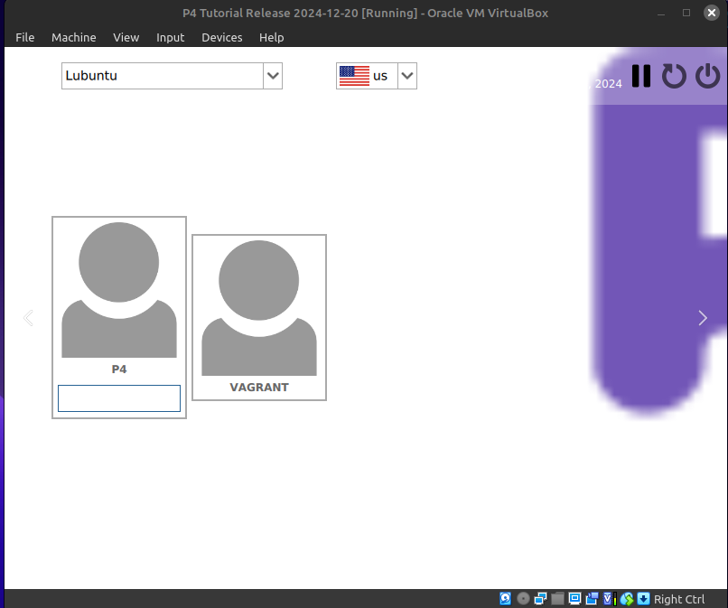
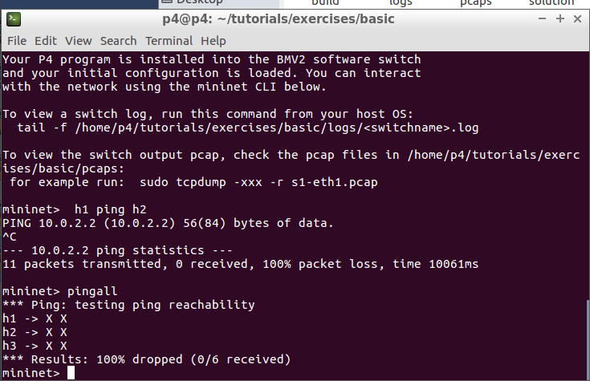
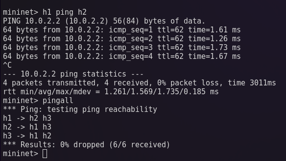
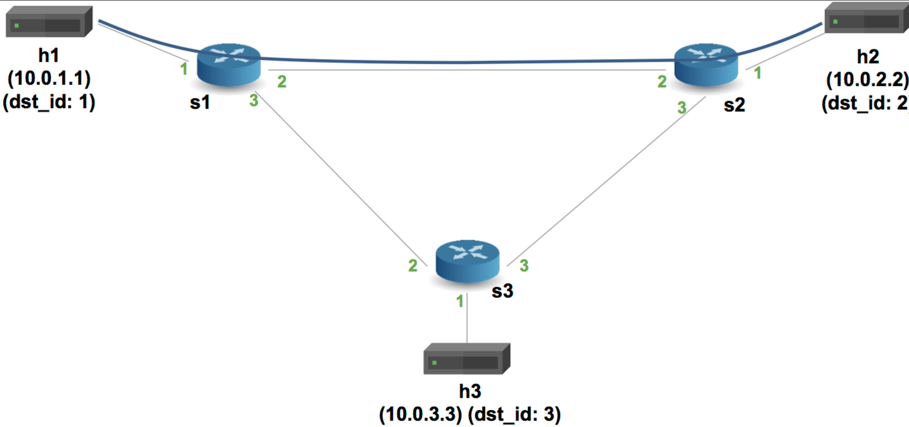
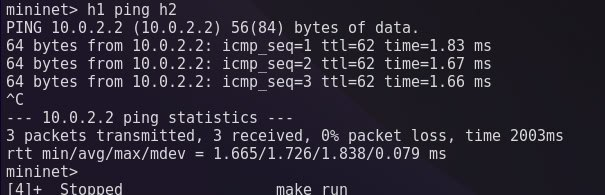
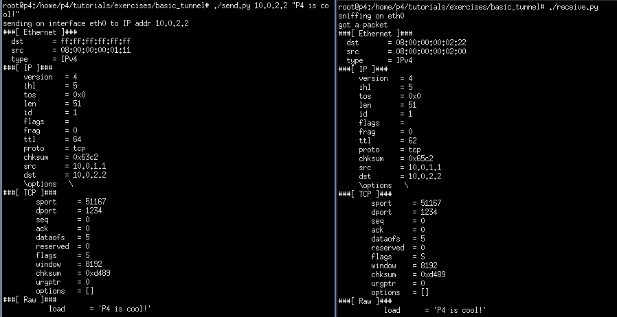
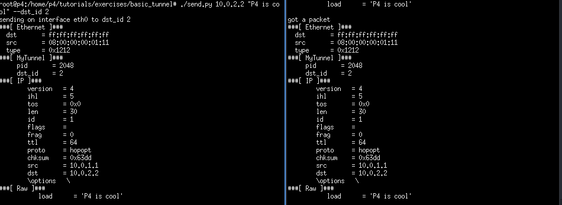
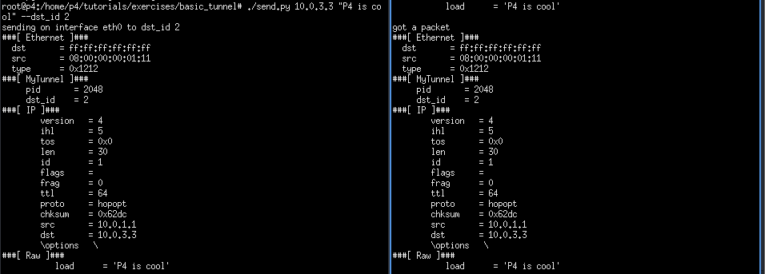

University: [ITMO University](https://itmo.ru/ru/)  
Faculty: [FICT](https://fict.itmo.ru)  
Course: [Network programming](https://github.com/itmo-ict-faculty/network-programming)  
Year: 2024/2025  
Group: K34212  
Author: Nikita Kuznetsov
Lab: Lab4
Date of create: 19.12.2024  
Date of finished: 20.12.2024

## Лабораторная работа №4 "Базовая 'коммутация' и туннелирование используя язык программирования P4"

## Описание

В данной лабораторной работе вы познакомитесь на практике с языком программирования P4, разработанный компанией Barefoot (ныне Intel) для организации процесса обработки сетевого трафика на скорости чипа. Barefoot разработал несколько FPGA чипов для обработки трафика которые были встроенны в некоторые модели коммутаторов Arista и Brocade.

## Цель работы

Изучить синтаксис языка программирования P4 и выполнить 2 задания обучающих задания от Open network foundation для ознакомления на практике с P4.

## Ход работы

В начале работы необходимо было установить виртуальную машину p4 с помощью Vagrant и VirtualBox.
К сожалению компиляция через Vagrant оказалась слишком долгой, поэтому был установлен готовый образ виртуальной машины по ссылке из [статьи](https://p4.org/p4_events/p4-developer-day-2/)



### Implementing Basic Forwarding

Первой частью лабораторной работы является задание Implementing Basic Forwarding. Далее, текст задания, переведенный на русский язык, а также схема сети:

```
Цель данного упражнения — написание программы на P4, реализующей базовую маршрутизацию. Для упрощения реализуется маршрутизация только для IPv4.

При маршрутизации IPv4 коммутатору необходимо выполнять следующие действия для каждого пакета: (i) обновление MAC-адресов источника и назначения, (ii) уменьшение значения времени жизни (TTL) в заголовке IP, и (iii) пересылка пакета через соответствующий порт.

Коммутатор будет оснащён единственной таблицей, которая заполняется плоскостью управления статическими правилами. Каждое правило сопоставляет IP-адрес с MAC-адресом и выходным портом для следующего узла. Правила плоскости управления уже определены, поэтому требуется только реализация логики плоскости данных в программе на P4.

Для данного упражнения используется следующая топология. Она представляет собой одну ячейку топологии fat-tree и называется pod-topo.
```


При запуске базового скрипта через `make run`, который поставляется с репозиторием - выдается ошибка при проверки связности хостов:



Чтобы это поправить, необходимо внести несколько изменений в скрипт:

1. Добавить в `Parser` заголовки для `ipv4` и `ethernet`:

```c
/*************************************************************************
*********************** P A R S E R  ***********************************
*************************************************************************/

parser MyParser(packet_in packet,
                out headers hdr,
                inout metadata meta,
                inout standard_metadata_t standard_metadata) {

    state start { transition parse; }

    state parse{
      packet.extract(hdr.ethernet);
      transition select(hdr.ethernet.etherType) {
        TYPE_IPV4: parse_ipv4;
        default: accept;
        }
    }

    state parse_ipv4{
      packet.extract(hdr.ipv4);
      transition accept;
    }
}
```

2. Добавить входной порт для переадресации пакетов `ipv4`, обновить исходные mac-адреса и адреса назначения, а также поменять значения TTL и добавить таблицы маршрутизации и условия проверки заголовка IPv4:

```c
/*************************************************************************
**************  I N G R E S S   P R O C E S S I N G   *******************
*************************************************************************/

control MyIngress(inout headers hdr,
                  inout metadata meta,
                  inout standard_metadata_t standard_metadata) {
    action drop() {
        mark_to_drop();
    }

    action ipv4_forward(macAddr_t dstAddr, egressSpec_t port) {
        standard_metadata.egress_spec= port;            // Изменение порта
        hdr.ethernet.srcAddr = hdr.ethernet.dstAddr;    // Изменение адреса источника
        hdr.ethernet.dstAddr = dstAddr;                 // Новый получатель
        hdr.ipv4.ttl = hdr.ipv4.ttl - 1;                // TTL
    }

    // Таблица маршрутизации
    table ipv4_lpm {
        key = {
            hdr.ipv4.dstAddr: lpm;
        }
        actions = {
            ipv4_forward;
            drop;
            NoAction;
        }
        size = 1024;
        default_action = NoAction();
    }

    apply {
        if (hdr.ipv4.isValid()) {
            ipv4_lpm.apply();
        }
    }
}
```

3. Написать `Deparser`, который выбирает порядок полей в исходящем пакете:

```c
/*************************************************************************
***********************  D E P A R S E R  *******************************
*************************************************************************/

control MyDeparser(packet_out packet, in headers hdr) {
    apply {
        packet.emit(hdr.ethernet);
        packet.emit(hdr.ipv4);
    }
}
```

После этого, можно заново проверить связность, всё работает (в этот раз подключился к машине через SSH):



### Implementing Basic Tunneling

Далее, необходимо выполнить другое задание - Implementing Basic Tunneling. Текст задания, переведенный на русский язык, а также схема сети:

```
В этом упражнении добавляется поддержка базового туннельного протокола в IP-маршрутизатор, завершённый в предыдущем задании. Базовый коммутатор выполняет пересылку на основе IP-адреса назначения. Требуется определить новый тип заголовка для инкапсуляции IP-пакета и модифицировать код коммутатора так, чтобы вместо этого выбор порта назначения осуществлялся с использованием нового туннельного заголовка.

Новый тип заголовка будет содержать идентификатор протокола, указывающий тип инкапсулируемого пакета, а также идентификатор назначения, используемый для маршрутизации.
```



Для работы туннелирования нужно модифицировать исходный файл:

1. Изменить Parser, чтобы он извлекал заголовки - `MyTunnel` или `ipv4` на основе `etherType`:

```c
/*************************************************************************
*********************** P A R S E R  ***********************************
*************************************************************************/

parser MyParser(packet_in packet,
                out headers hdr,
                inout metadata meta,
                inout standard_metadata_t standard_metadata) {

    state start {
        transition parse_ethernet;
    }

    state parse_ethernet {
        packet.extract(hdr.ethernet);
        transition select(hdr.ethernet.etherType) {
            TYPE_MYTUNNEL: parse_myTunnel;
            TYPE_IPV4: parse_ipv4;
            default: accept;
        }
    }

    state parse_myTunnel { // Заголовок myTunnel
        packet.extract(hdr.myTunnel);
        transition select(hdr.myTunnel.proto_id) {
            TYPE_IPV4: parse_ipv4;
            default: accept;
        }
    }

    state parse_ipv4 {
        packet.extract(hdr.ipv4);
        transition accept;
    }
}
```

2. Также аналогично изменить Deparser:

```c
/*************************************************************************
***********************  D E P A R S E R  *******************************
*************************************************************************/

control MyDeparser(packet_out packet, in headers hdr) {
    apply {
        packet.emit(hdr.ethernet);
        packet.emit(hdr.myTunnel); // Заголовок myTunnel
        packet.emit(hdr.ipv4);
    }
}
```

3. Создать действие с именем myTunnel_forward, которое отвечает за установку порта выхода. Добавить таблицу, аналогичную ipv4_lpm, но вместо стандартной пересылки реализуется туннельная. Блок apply в управлении MyIngress обновить для применения новой таблицы myTunnel_exact.

```c
/*************************************************************************
**************  I N G R E S S   P R O C E S S I N G   *******************
*************************************************************************/

control MyIngress(inout headers hdr,
                  inout metadata meta,
                  inout standard_metadata_t standard_metadata) {
    action drop() {
        mark_to_drop();
    }

    action ipv4_forward(macAddr_t dstAddr, egressSpec_t port) {
        standard_metadata.egress_spec = port;
        hdr.ethernet.srcAddr = hdr.ethernet.dstAddr;
        hdr.ethernet.dstAddr = dstAddr;
        hdr.ipv4.ttl = hdr.ipv4.ttl - 1;
    }

    table ipv4_lpm {
        key = {
            hdr.ipv4.dstAddr: lpm;
        }
        actions = {
            ipv4_forward;
            drop;
            NoAction;
        }
        size = 1024;
        default_action = drop();
    }

    action myTunnel_forward(egressSpec_t port) {
        standard_metadata.egress_spec = port;
    }

    table myTunnel_exact {
        key = {
            hdr.myTunnel.dst_id: exact;
        }
        actions = {
            myTunnel_forward;
            drop;
        }
        size = 1024;
        default_action = drop();
    }

    apply {
        if (hdr.ipv4.isValid() && !hdr.myTunnel.isValid()) {
            ipv4_lpm.apply();
        }

        if (hdr.myTunnel.isValid()) {
            myTunnel_exact.apply();
        }
    }
}
```

Далее, аналогично первому заданию, проверяется связность - хосты связаны:


Теперь, тестирование:

1. `./send.py 10.0.2.2 "P4 is cool"`



2. `./send.py 10.0.2.2 "P4 is cool" --dst_id 2`



3. `./send.py 10.0.3.3 "P4 is cool" --dst_id 2`



## Вывод

В ходе выполнения лабораторной работы было произведено ознакомление с языком программирования для работы с сетевым трафиком на уровне чипа `p4`, а также его возможностями по созданию базовых сетей, а также туннелирования. Были выполнены два задания из основного репозитория, а также проверена работоспособность полученных решений.
